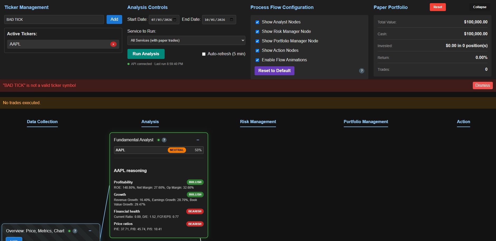
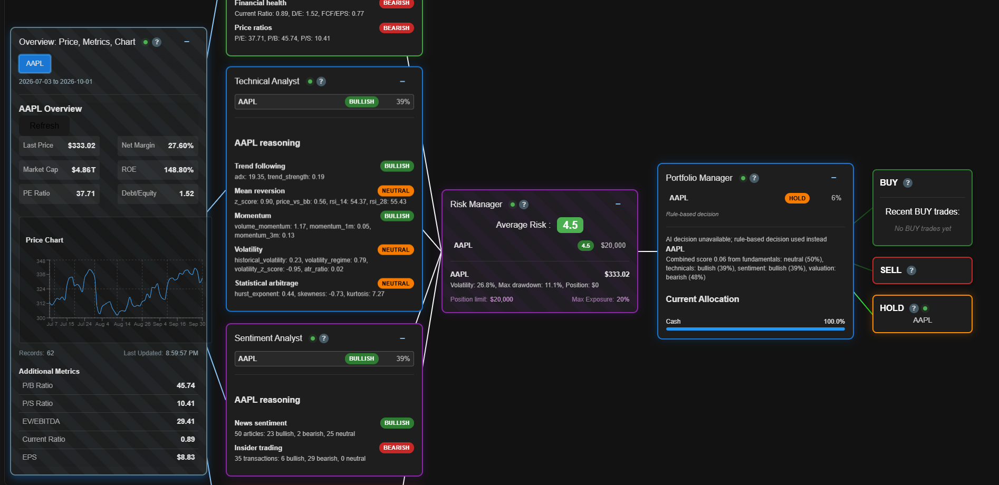
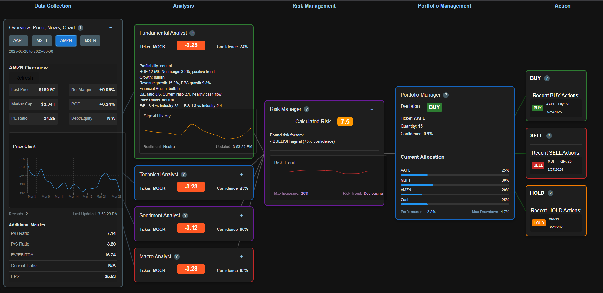

# AI-HedgeFund - React / Express / AI Financial Analysis

A Web App built with React as a Frontend and Express as a Backend. It uses AI-driven analysis to provide financial insights and portfolio management through an interactive visualization of the investment process flow.

## Frontend: [AI-HedgeFund React Frontend](https://github.com/ivaaak/AI-HedgeFund/blob/main/frontend/README.md)
## Backend: [AI-HedgeFund Express Backend](https://github.com/ivaaak/AI-HedgeFund/blob/main/backend/README.md)

**Screenshots:**
</img>
</img>
</img>

### Getting Started:
Copy `backend/.env.example` to `backend/.env` and fill in the keys you have:
```cmd
ALPHA_VANTAGE_API_KEY= (Market data - required, a free key allows 25 requests per day)
OPENAI_API_KEY= or ANTHROPIC_API_KEY= (optional - AI portfolio decisions, otherwise rule-based)
API_KEY= and API_KEY_REQUIRED=true (optional - secures the endpoints)
PORT= (default: 3000)
```

You can run the below commands from the AI-HedgeFund directory and start the project:
```cmd
npm i
npm start
```

This installs and starts both the FE and BE using the npm tool 'concurrently'. Or you can run the commands separately in the frontend / backend folders to have them running in separate instances/terminals.

### Built With:
-  [**✔**]  `React (TypeScript)`
-  [**✔**]  `Express API`
-  [**✔**]  `OpenAI / Claude Integration` (optional, with a rule-based fallback)
-  [**✔**]  `Axios`
-  [**✔**]  `Process Flow Visualization`
-  [**✔**]  `Alpha Vantage Financial Data API`

### Features / `Analysis Modes`:
- `Fundamental Analysis`
- `Technical Analysis`
- `Sentiment Analysis`
- `Valuation Analysis`
- Risk Management Visualization
- Portfolio Decision Making
- Paper Trading and Performance Tracking
- Data Collection Nodes
- Interactive Process Flow
- Auto-refresh

#### Not implemented yet / In Progress:
- `Backtesting Engine` for strategy validation
- `Multiple Portfolio Management` for different risk profiles
- `Custom AI Models` for specialized financial forecasting
- `Algorithm Marketplace` for sharing and subscribing to strategies
- `Reporting System` for detailed investment performance analysis
- `Mobile Application` for on-the-go monitoring
- `Email Alerts` for critical portfolio actions
- `Advanced Charting` with technical indicators
- `Social Trading` features for community insights
- `Integration with Trading Platforms` for direct execution